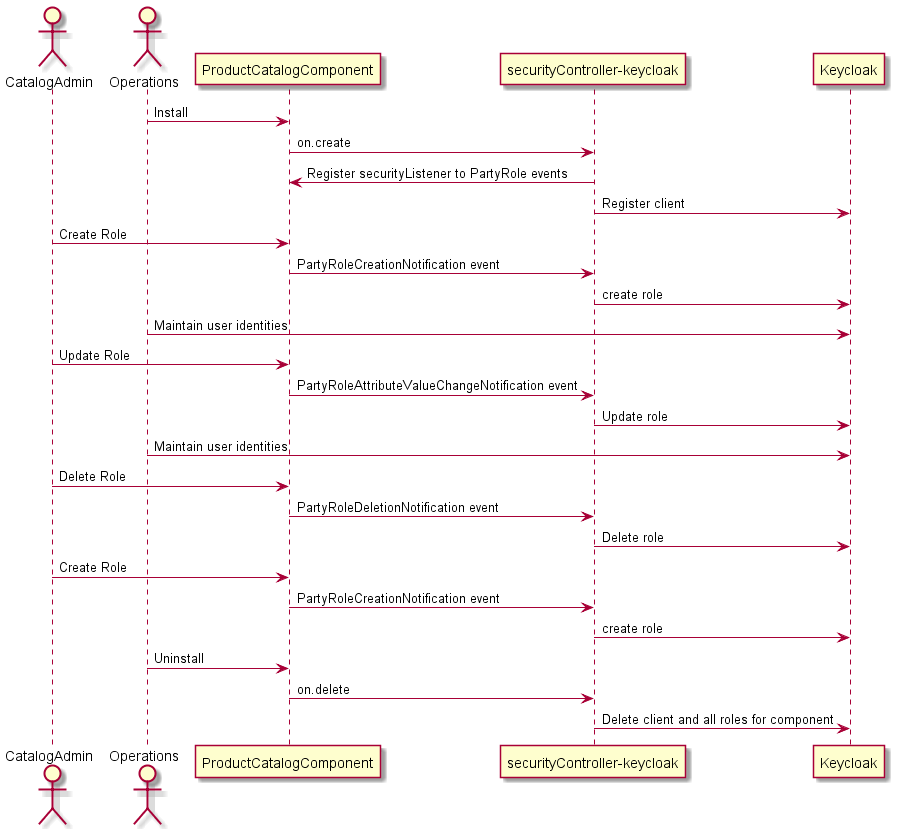
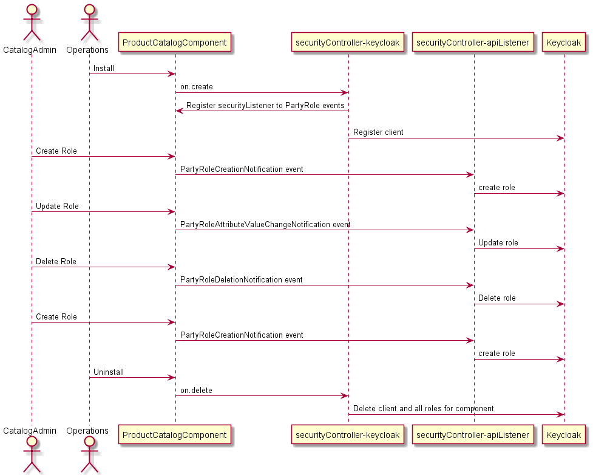

# Security Controller

This is the reference implementaiton of a security controller that takes metadata from ODA Component and uses it to automatically configure the Identity service (using Keycloak in the reference implementation). The security controller expects the component to expose a TMF669 PartyRole API detailing all the roles to be added to the identity service. The sequence diagram shows the overall flow:





The security controller consists of two modules, both written in Python. The first module uses the KOPF (https://kopf.readthedocs.io/) framework to listen for components being deployed in the ODA Canvas. It set's up the base `Client` registration in Keycloak and then registers for call-back events from the components PartyRole API. The second module provides the API server where these PartyRole callback events are handled. It receives create/update/delete events and creates/updates/deletes the corresponding  roles in Keycloak. See the more detailed sequence diagram below:





# Notes

Keycloak setup

Relm = whole organisation
Client (within Relm) = 1 App or component

Roles can be scoped at relm or client level
Users can be scoped at relm or client level


# Tasks to set up development environment (tested on Docker for Windows)

Install keycloak and set Environmnet variables for username and password (from https://www.keycloak.org/getting-started/getting-started-kube)

```
kubectl create -f https://raw.githubusercontent.com/keycloak/keycloak-quickstarts/latest/kubernetes-examples/keycloak.yaml
```

Keycloak is created with a Service exposed at `http://localhost:8080/auth/`


To run python module standalone:

1. Ensure url's `kcBaseURL` and `prBaseURL` are set correctly in keycloaktestapp.py
2. Install required python modules with `pip install -r .\requirements.txt`
3. Run `python keycloaktestapp.py`
4. Set the environment variables for login to keycloak

```
$env:KEYCLOAK_USER = "admin"
$env:KEYCLOAK_PASSWORD = "admin"
```

5. Configure a new relm `myrealm` in keycloak.
6. Configure a new client `r1-productcatalog` in the `myrealm` relm.


# Testing KOPF module

Run: `kopf run --namespace=components --standalone .\securityController-keycloak.py`
